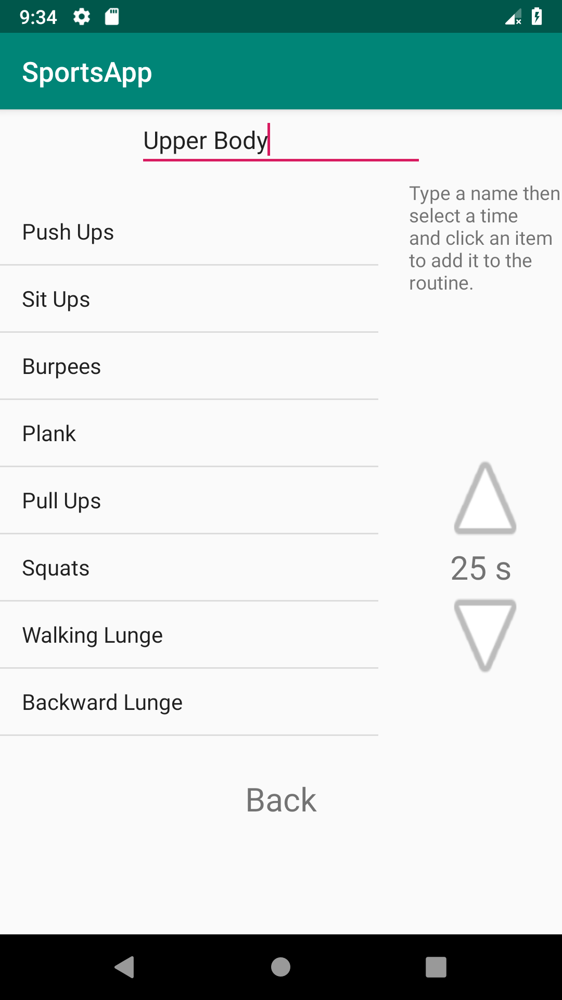
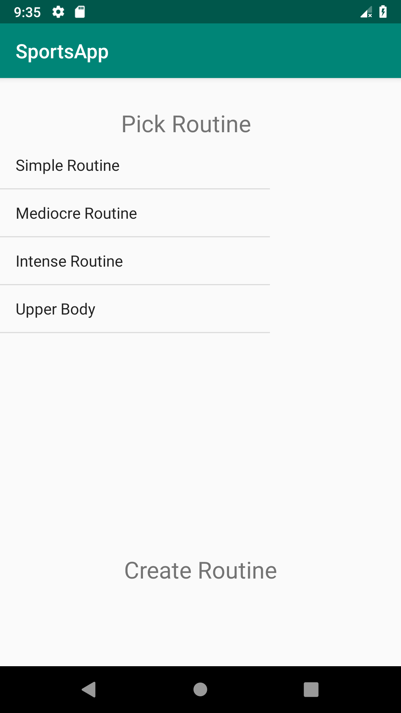
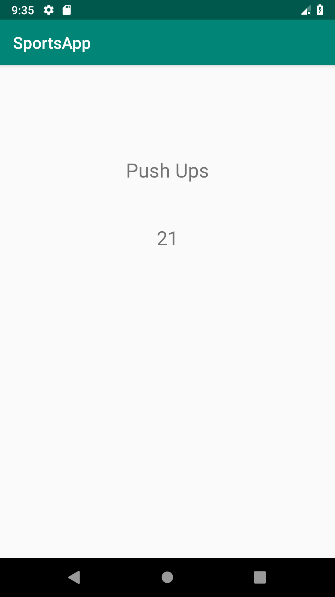

# Android-Sports-Application
This was a university project for the Android course. The application is a workout list with a timer to help gym goers time their sets and exercises. Only things learned within the course were allowed to be used in this project.
The application has built in routines to use but anyone can create their own!
Once you want to create a new routine 
1. Click the "Create Routine" button at the buttom.
2. Enter the routine name.
3. Choose the time you want (in seconds) on the right.
4. Click an exercise to add it with that time chosen.
You can add the same exercise multiple times.

  
